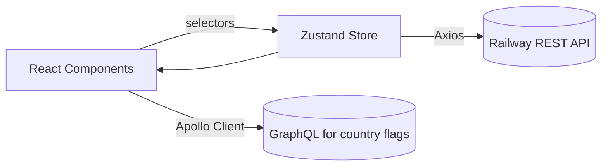
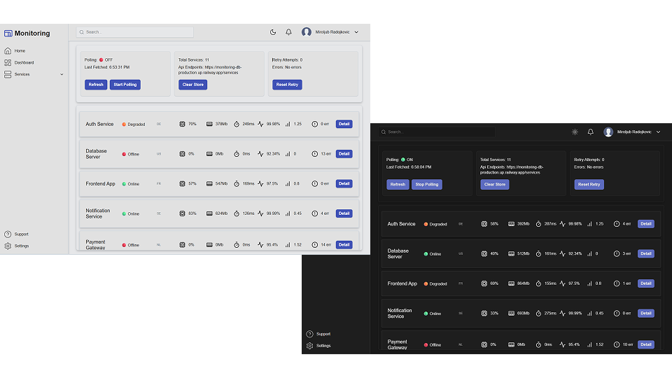
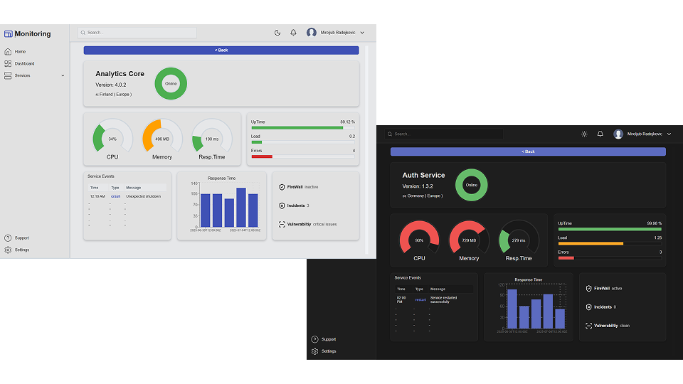

# Monitoring Dashboard

**Real-time monitoring demo with store-driven polling and charts, built in React + TypeScript.**

**Goal:** Display real-time service data through store-managed polling.

### What this demo shows

- Store-level polling (Zustand) with controls (Refresh / Start–Stop / Clear / Retry)
- Hosted mock API on Railway updating ~10s
- Services list and Details view with Recharts time-series
- Desktop-only UI with dark/light theme (Emotion)
- Client-side search by name
- Apollo/GraphQL for country flags

### Tech stack

React, TypeScript, Zustand, Emotion, Axios, Apollo Client (GraphQL), Recharts, Jest + React Testing Library, Lucide.

### Quick start

```bash
git clone https://github.com/miroljub99/monitoring-dashboard.git
cd monitoring-dashboard
npm install
npm run dev
```

*No .env required. No local backend — data comes from a hosted mock API.*


---

### Recruiter TL;DR

- Real-time demo; no local backend. REST data updates ~10s (Railway). Country flags via GraphQL/Apollo.
- What to skim (2–3 min): `src/stores/servicesStore.ts`, `src/pages/Dashboard/Dashboard.tsx`, `src/container/ServiceDetail/ServiceDetail.tsx`, `src/Charts/ResponsiveTimeChart.tsx`.
- Patterns: store-level polling (Zustand), typed selectors, Recharts time-series, client-side search, Emotion theming.
- Scope: **desktop-only**; partial tests (Jest + RTL).

### Architecture at a glance



- Polling timer and controls live in the **Zustand store** (`servicesStore`), keeping components simple and reactive.
- REST provides metrics and events; GraphQL is used only for country flags.

### Project structure (selected)

```
src/
  api/                  # axios client + service calls (with tests)
  Charts/               # charts (donut, mini bar, responsive time, status badge)
  components/           # UI building blocks (Header, Sidebar, cards, tables, etc.)
  container/            # composition/wiring (ServiceList, ServiceDetail, ServiceContainer)
  graphql/              # Apollo client + queries (country flag)
  pages/                # Home, Dashboard, PageNotFound
  stores/               # Zustand stores (servicesStore, toggleStore) + tests
  theme/                # Emotion theme + global styles
  types/                # shared TS types (service, state, location, etc.)
  utils/                # helpers (chart utils, hooks, mappers)
```

### How to review this repo (fast track)

- **State & polling:** `src/stores/servicesStore.ts` (polling logic + selectors + start/stop/refresh/clear/retry)
- **Dashboard:** `src/pages/Dashboard/Dashboard.tsx`
- **Details wiring:** `src/container/ServiceDetail/ServiceDetail.tsx`
- **Time-series chart:** `src/Charts/ResponsiveTimeChart.tsx`
- **Service card & list:** `src/components/ServiceCard/ServiceCard.tsx`, `src/container/ServiceList/ServiceList.tsx`
- **HTTP layer:** `src/api/servicesApi.ts`, `src/api/index.ts`
- **GraphQL flag:** `src/graphql/queries/country.ts`
- **Theme:** `src/theme/*`
- **Tests (examples):** `src/api/servicesApi.test.ts`, `src/components/ServiceCard/ServiceCard.test.tsx`, `src/container/ServiceList/ServiceList.test.tsx`, `src/stores/servicesStore.test.ts`, `src/graphql/queries/country.test.tsx`


### Testing & quality

```bash
# run unit/component tests
npm test
```

- Jest + React Testing Library (selected components, store, GraphQL query tests).
- Intentional: **partial** coverage (focus on critical branches and selectors).
- Next steps (recommended): add **ESLint/Prettier** scripts and a **GitHub Actions** workflow to run `test` (and `lint`) on every push/PR; add a CI badge at the top of this README.

### Status / Roadmap / Out of scope

- **Status:** stable demo for portfolio review; actively evolving.
- **Roadmap:** CI (tests + lint) badge • screenshots/GIF • p95/p99 metrics • more targeted tests • small perf tweaks • minor code polish • optional WebSockets/SSE (or GraphQL subscriptions) to replace polling.
- **Out of scope:** mobile/tablet • real backend/auth/notifications • comprehensive test coverage • WebSockets/SSE real-time transport (this demo uses polling).

### Screenshots



